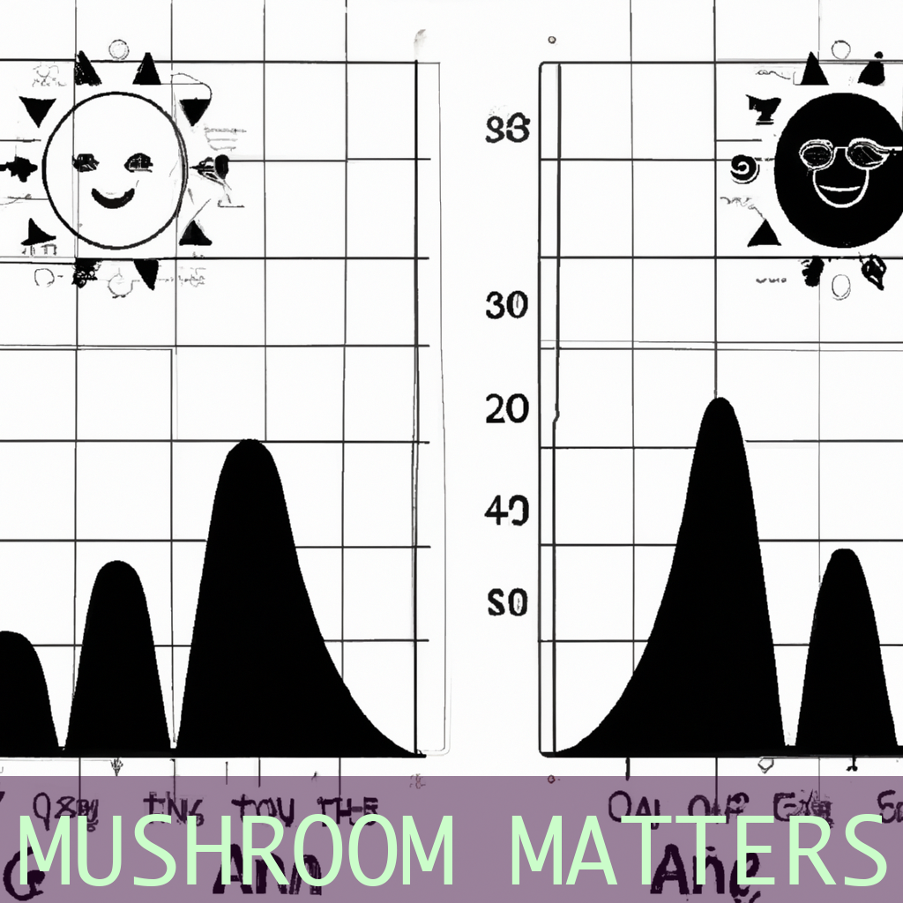

# Self Promotion Post Generator

Python tools to generate and post fake self-promotional material to LinkedIn. Uses OpenAI's GPT-3 API to generate fake self-promotional material text and images and then posts them to LinkedIn (ok... the auto-posting part is still not reliably working because LinkedIn is trying to block it, so you may need to manually post the generated text and images for now).

## Examples

Can't believe I was able to launch my own mycological business at the FungiFest event in Portland on June 1st - so proud of all the hard work that went into it! #mycology #entrepreneurship #productlaunch #portlandfungifest

---

OMG I just found out I was chosen for the GreenGenius Biohacking Fellowship and I'll be spending the summer in Hawaii learning all about sustainable living - can't wait to share my experience with you all! #GreenGeniusFellowship #BiohackingSabbatical #SustainableLiving #HawaiiHereICome

---

Just found out that I'll be receiving the "Mentor of the Year" award at the upcoming DataCon East conference in Boston on June 8th - can't wait to celebrate with my data science community! #DataConEast #MentorshipMatters #CelebratingSuccess #DataScienceCommunity

## Installation

You must first create an [OpenAI account](https://platform.openai.com/) and create an API key. Then, create a `.env` file in the root directory and add your API key to it. See the file named `env.example` for details of the format of that file.

### Selenium

Posting to LinkedIn requires you have installed a [selenium driver for chrome](https://chromedriver.chromium.org/downloads) - download and install the appropriate one for your system. If you're on Mac, place the `chromedriver` file into `/usr/local/bin`. On Windows, place it in `C:\Windows\` or somewhere else that is in your system's `PATH` variable.

### Other dependencies

Install other dependencies with `pip install -r requirements.txt` (or preferably `pipenv install` and then `pipenv shell` if you have [pipenv](https://pypi.org/project/pipenv/) installed).

## Running

- Run `python generate_post.py` (or `python3 generate_post.py`, depending on your system) and the generated images and text will be placed in the `posts` directory.
- Update the variables at the top of `post_to_linkedin.py` with the text and image filename that were generated.

## Bugs

- Doesn't yet reliably post images to LinkedIn automatically... still need to defeat some hurdles that LinkedIn is sillily putting in the way of automation... post the generated content manually for now... it goes without saying that LinkedIn will lose the automation battle.
- Sometimes picks illegible fonts that mess up the generated image.... need to be more selective of only fonts with English characters.
- Sometimes captions for images overflow the image... probably a font issue
